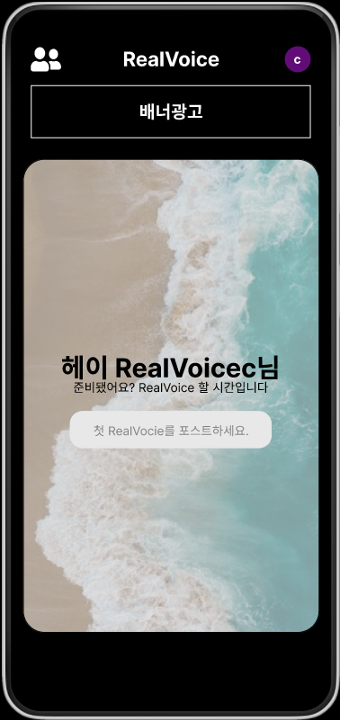
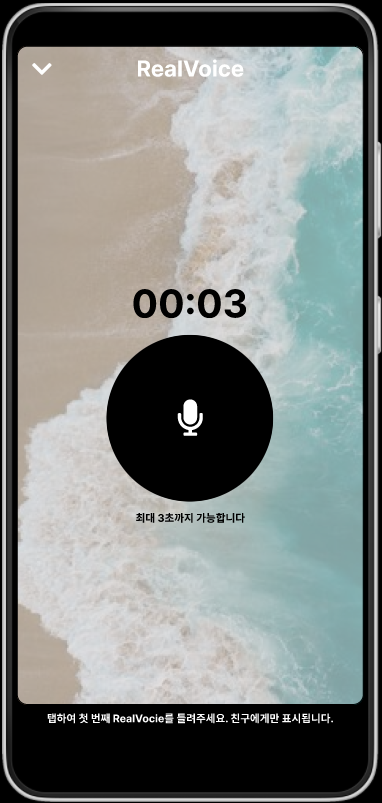
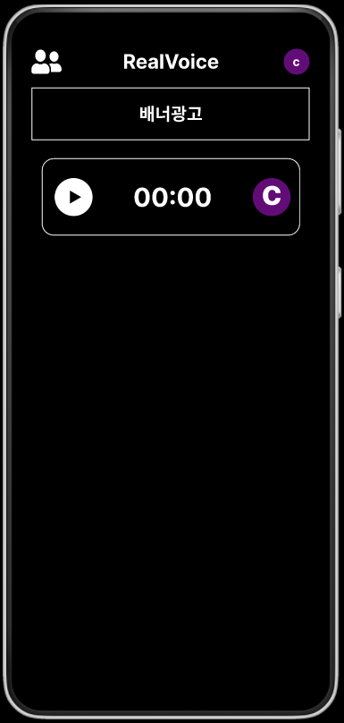

# Real Voice

```
9 to 6 랜덤한 시간에 알람이 울리면 현재 자신의 목소리를 업로드 하는 VNS (Voice Network Service)
```
- [Real Company](https://www.notion.so/real-company/Real-Voice-15ed659f94334472a410203a650e1449) : Real Voice의 홈페이지

## Developer
- 김영찬(PM, Frontend)
- 이강훈, 이호성(Backend)

## Repositories
- [Backend Repository](https://github.com/kangwhon/RealVoice)

## Develop
<div style="display: flex: flex-direction: row;">
  
  
  
  
</div>